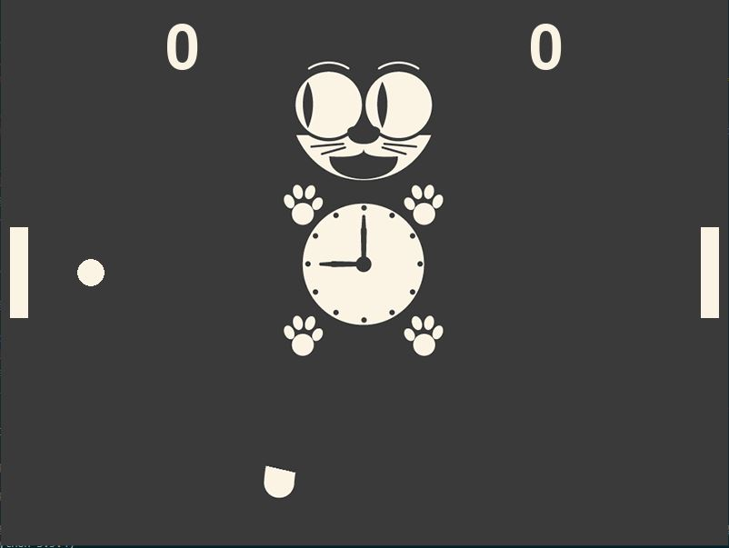

# pong

## Introdução
Para quem não sabe, o pong é um jogo clássico do primeiro console da Atari onde há duas barras diametralmente opostas e colocadas, cada uma, em um canto horizontal da tela. Uma bolinha é posta no centro e, inicialmente, se dirige para um lado da tela. Os jogadores não podem deixar a bola extrapolar para fora do canto deste da tela. Se isto acontecer, o jogador oponente leva ponto. Ganha quem antingir uma determinada quantidade de pontos primeiro.

## Trabalho
O jogo Pong foi feito como um trabalho para o curso de Laboratório de Programação de Jogos - 2º período no curso de Ciência da Computação na Universidade Federal Fluminense (UFF). Para o projeto, foi-se utilizado a linguagem Python e a biblioteca Pygame. Vale lembrar que, como tela de fundo, há um gato que segue a bola com os olhos.

## Tela do Pong

